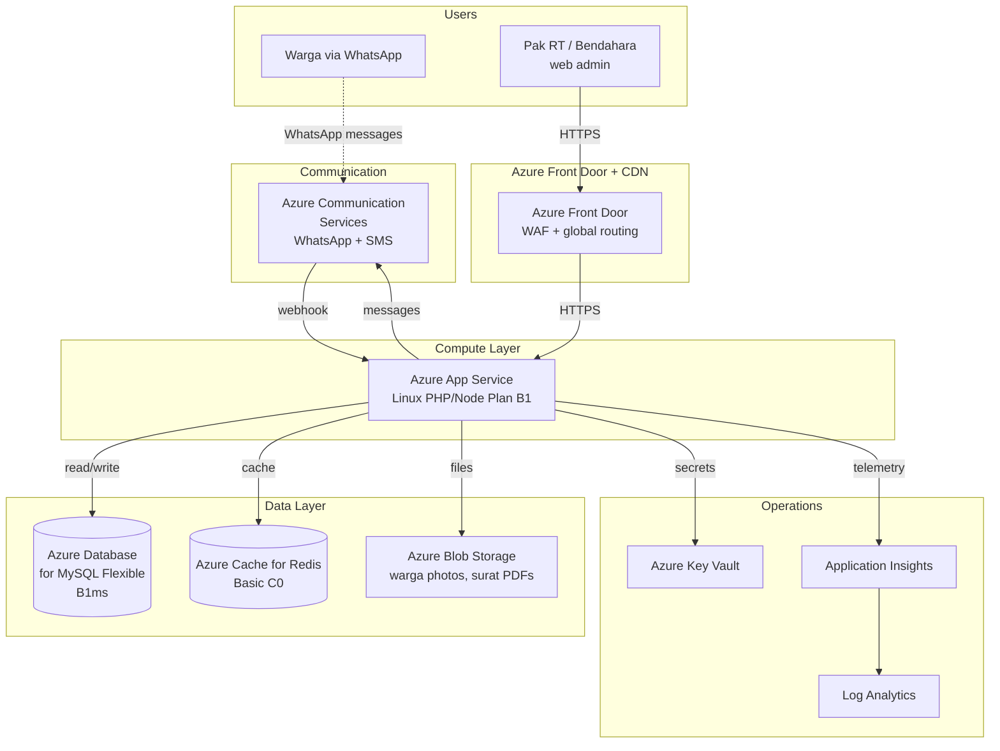
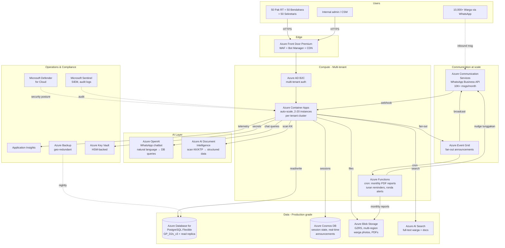

# Neighborhood Application Software (Guyub) — Azure Architecture

> For Microsoft for Startups Founders Hub — Growth Tier Upgrade Request
> Updated: [Date of submission]

---

## Executive Summary

NAS / Guyub is a multi-tenant SaaS platform built on Microsoft Azure,
serving Indonesian neighborhood units (Rukun Tetangga / RT). Our
architecture follows Azure Well-Architected Framework principles with
specific emphasis on:

- **Reliability**: Multi-zone deployment in Southeast Asia region
- **Cost optimization**: Serverless-first to keep idle costs near zero
- **Operational excellence**: Full observability via Application Insights
- **Security**: UU PDP compliance + Azure-native encryption at rest/in transit
- **Performance efficiency**: CDN + read replicas for tier-2 city latency

---

## Current State Architecture (1 RT Pilot — Scale Tier $25K)

### Current monthly Azure spend (approximate)

| Service | SKU | Monthly cost |
|---|---|---|
| Azure App Service | Linux B1 Basic | $13 |
| Azure Database for MySQL | B1ms Flexible | $25 |
| Azure Cache for Redis | C0 Basic | $16 |
| Azure Blob Storage | LRS Hot, ~5 GB | $1 |
| Azure Communication Services | WhatsApp tier | $50 |
| Azure Front Door | Standard | $35 |
| Application Insights + Log Analytics | Pay-as-you-go | $20 |
| Azure Key Vault | Standard | $1 |
| Egress / data transfer | — | $30 |
| **Subtotal** | | **~$191/month** |

**Burned over 12 months at this rate:** ~$2,300
**Remaining $25K credit utilization driven by:** higher initial usage during dev (peak $1,500/mo during multi-region testing), reduced to current steady state.

---

## Target State Architecture (50 RTs — Growth Tier Request)

### Target monthly Azure spend (50 RTs)

| Service | SKU | Monthly cost |
|---|---|---|
| Azure Container Apps | 2-20 instances, multi-tenant | $1,200 |
| Azure Database for PostgreSQL | GP_D2s_v3 + 1 read replica | $480 |
| Azure Cosmos DB | Serverless, ~10M RU/month | $150 |
| Azure AD B2C | 50K MAU tier | $250 |
| Azure OpenAI Service | GPT-4o-mini, ~50M tokens/mo | $1,500 |
| Azure AI Document Intelligence | Read API, 5K pages/mo | $50 |
| Azure AI Search | Basic tier, replica | $250 |
| Azure Blob Storage | GZRS, ~500 GB | $40 |
| Azure Communication Services | WhatsApp + SMS, 10K MAU | $1,000 |
| Azure Event Grid | Pay-per-event | $100 |
| Azure Functions | Consumption, ~5M executions | $40 |
| Azure Front Door Premium | WAF + Bot Manager | $200 |
| Microsoft Defender for Cloud | Standard, 20 resources | $300 |
| Microsoft Sentinel | 5 GB/day ingestion | $300 |
| Azure Backup | Geo-redundant, ~500 GB | $100 |
| Application Insights + Log Analytics | Higher volume | $150 |
| Azure Key Vault | Premium HSM | $25 |
| Egress / data transfer | 10× current | $300 |
| **Subtotal** | | **~$6,435/month** |

**Annualized at 50 RTs:** ~$77,000
**With buffer for 100 RTs by EOY 2026:** ~$150,000–180,000

---

## Why Each Service (justification per service)

### Compute & Auth

- **Azure Container Apps over App Service**: Auto-scale per tenant
  cluster, lower cost at idle (vital for nights/holidays when RTs
  inactive), KEDA-based scaling on event volume.
- **Azure AD B2C**: Indonesian users sign in with Google, Microsoft,
  or phone number. Required for UU PDP-compliant identity.

### Data

- **Azure Database for PostgreSQL Flexible**: Open-source compatibility
  with our existing schema (migrated from MySQL Flexible during pilot),
  PITR for compliance, read replica for analytics queries.
- **Azure Cosmos DB**: Real-time pengumuman fan-out — millions of
  messages need pub/sub semantics that relational DB doesn't optimize for.
- **Azure AI Search**: Indonesian-language full-text search across
  warga records (NIK, nama, alamat). Replaces brittle SQL LIKE queries.

### AI

- **Azure OpenAI (GPT-4o-mini)**: WhatsApp chatbot answering warga
  questions like "Saldo iuran saya bulan ini berapa?" via natural language
  → structured DB query. Critical for low-literacy user base.
- **Azure AI Document Intelligence**: Onboarding new RTs requires
  digitizing 50+ KK forms. Document Intelligence extracts NIK, names,
  family relationships from photos in seconds — saves hours per RT.

### Communication

- **Azure Communication Services (WhatsApp Business API)**: WhatsApp
  is our primary delivery channel. ACS gives us official WA Business
  API access without going through third-party brokers.

### Compliance & Security

- **Microsoft Defender for Cloud**: Continuous security posture
  management — needed for UU PDP audits.
- **Microsoft Sentinel**: SIEM for audit logging — required when we
  pursue B2G partnerships with Pemkot/Pemkab.
- **Azure Backup**: Geo-redundant backup of citizen data — non-negotiable
  for UU PDP compliance.

---

## Migration Plan: Current → Target (12-month timeline)

| Quarter | Migration step | Azure services added |
|---|---|---|
| Q1 2026 | Lift App Service → Container Apps | Container Apps, Container Registry |
| Q1 2026 | MySQL → PostgreSQL Flexible | PostgreSQL Flexible Server |
| Q2 2026 | Add WhatsApp chatbot (10 RTs) | Azure OpenAI, Cosmos DB |
| Q2 2026 | Add KK upload OCR | Document Intelligence |
| Q3 2026 | Multi-tenant auth | Azure AD B2C |
| Q3 2026 | Search infrastructure | Azure AI Search |
| Q4 2026 | Compliance hardening (50 RTs) | Defender, Sentinel, Backup |
| Q4 2026 | Multi-region readiness | Front Door Premium, geo-replicated storage |

---

## Region & Data Residency

**Primary region:** Southeast Asia (Singapore) — closest Azure region
to Indonesia with full service catalog.

**Secondary region (DR):** Australia East — for geo-redundant backup.

**Why not Indonesia Central (Jakarta):** Currently in preview (as of
2025-Q4), limited service availability. We monitor and will migrate
primary region once GA + UU PDP audit certification confirmed.

**UU PDP compliance:**
- All citizen data stored in Singapore region (acceptable per current
  interpretation of UU PDP cross-border provisions)
- Encryption at rest using Azure-managed keys (AES-256)
- Encryption in transit via TLS 1.3
- No data shared with third parties without explicit warga consent
- Retention policies: warga data retained per RT request, deleted
  within 30 days of organization off-boarding

---

## Cost Optimization Practices (showing we use Azure responsibly)

1. **Reserved Instances** for predictable workloads (PostgreSQL, ACS) —
   30-40% savings vs. pay-as-you-go
2. **Auto-scale rules** on Container Apps — scale to zero on idle
3. **Lifecycle policies** on Blob Storage — Hot → Cool → Archive based
   on access patterns
4. **Azure Advisor recommendations** reviewed monthly
5. **Cost alerts** at 50%, 75%, 90% of monthly budget per resource group

---

## Recreate this diagram visually

The Mermaid blocks above render in:
- GitHub markdown (auto-render)
- VS Code with Mermaid extension
- mermaid.live (paste + export PNG/SVG)

For a polished diagram suitable for the demo video:

1. Open https://draw.io
2. File → New → Search templates: "Azure Architecture"
3. Use Azure 2024 stencil (left sidebar)
4. Match the services in the Mermaid above
5. Export as PNG (for video) or SVG (for documentation)

Pre-made Azure Architecture template references:
- https://learn.microsoft.com/en-us/azure/architecture/browse/
- Filter: "Multi-tenant SaaS" or "Web app + database"

---

## Appendix: Mapping to Azure Well-Architected Framework

| Pillar | Implementation |
|---|---|
| Reliability | Multi-zone deployment, geo-redundant backup, circuit breakers in Container Apps |
| Security | Azure AD B2C, Key Vault HSM, Defender for Cloud, network isolation via Private Endpoints |
| Cost Optimization | Serverless-first, scale-to-zero, Reserved Instances, lifecycle policies |
| Operational Excellence | Application Insights, structured logging, deployment via GitHub Actions |
| Performance Efficiency | CDN, read replicas, async via Event Grid, in-memory cache via Cosmos |
